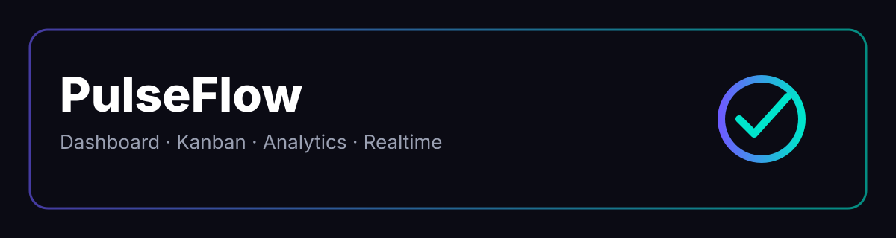
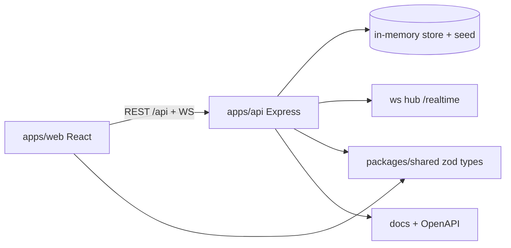

<div align="center">
  
  <h1>PulseFlow</h1>
  <p><strong>Realtime productivity platform — Dashboard · Kanban · Analytics · WebSockets</strong></p>
  <p>Open-source Notion-meets-Trello alternative with realtime collaboration — built 2026-stack.</p>

  [](LICENSE)
  [](.nvmrc)
  [](.github/workflows/ci.yml)
  [](docker/docker-compose.yml)
  [](packages/config/tsconfig.base.json)
  [](docs/CONTRIBUTING.md)
</div>

<div align="center">
  
</div>

## ✨ Features

| Area | What you get |
|------|--------------|
| 📊 Dashboard | KPI cards, SVG charts, activity feed, command palette |
| 📋 Kanban | Drag-drop columns (ToDo / Doing / Done), task detail, filters |
| 📈 Analytics | Throughput, burndown, per-member stats, export CSV |
| ⚡ Realtime | `ws` WebSocket hub — task moves broadcast instantly |
| 🔐 Auth | JWT access (15m) + opaque refresh rotation, bcrypt, RBAC |
| 🧱 Monorepo | `apps/api` + `apps/web` + `packages/shared` + `packages/ui-kit` |
| 🐳 Deploy | Multi-stage Docker, compose, nginx, K8s stub, GH Actions gates |
| 🧪 Quality | Vitest + Supertest, typecheck, health checks, seed scripts |

## 🏗️ Architecture



## 🚀 Quick Start (3 steps)

```bash
# 1. Install
npm install
# or per app:
npm install --workspace=apps/api
npm install --workspace=apps/web

# 2. Configure
cp .env.example apps/api/.env
# edit JWT_SECRET: openssl rand -hex 32

# 3. Run
npm run dev
# api → http://localhost:3000  | web → http://localhost:5173
```

Demo login (seeded): `demo@pulseflow.io` / `password123`

## 📦 Project Structure

```
pulseflow/
├── apps/api/            # Express 5 + TS API (auth, tasks, projects, WS)
├── apps/web/            # React 19 + Vite + Tailwind v4 dashboard
├── packages/shared/     # Zod schemas, types, utils (@pulseflow/shared)
├── packages/ui-kit/     # Tiny shared React UI
├── packages/config/     # tsconfig / eslint bases
├── docker/              # Dockerfiles + compose + nginx
├── infrastructure/      # k8s + monitoring stubs
├── .github/workflows/   # CI, security, release
├── docs/                # architecture, api, decisions, roadmap
├── scripts/             # dev, build, seed, health
├── branding/            # logo, banner, brand tokens
└── tools/               # generators
```

## 🔌 API Snapshot

| Method | Route | Auth | Body |
|--------|-------|------|------|
| GET | `/health` | — | → `{status}` |
| POST | `/api/auth/register` | — | `{name,email,password}` |
| POST | `/api/auth/login` | — | `{email,password}` → `{token,user}` |
| GET | `/api/auth/me` | Bearer | → `{user}` |
| GET/POST | `/api/tasks` | Bearer | CRUD + `?status=` |
| PATCH/DELETE | `/api/tasks/:id` | Bearer | move, edit |
| GET/POST | `/api/projects` | Bearer | CRUD |
| WS | `/realtime` | token query | `task.created/updated/moved` events |

Full contracts: [docs/API.md](docs/API.md)

## 🧪 Tests

```bash
npm run test --workspace=apps/api     # vitest + supertest
npm run test --workspace=packages/shared
npm run build --workspace=apps/api
npm run build --workspace=apps/web
```

## 🐳 Docker

```bash
docker compose -f docker/docker-compose.yml up --build
# web :8080 | api :3000
```

## 📚 Docs

- [Architecture](docs/ARCHITECTURE.md) · [Setup](docs/SETUP.md) · [Testing](docs/TESTING.md)
- [Decisions](docs/DECISIONS/0001-stack.md) · [Roadmap](docs/ROADMAP.md) · [Contributing](docs/CONTRIBUTING.md)

## 🧬 Branding

See [branding/](branding/) — logo SVG, banner, colors (`#6C5CFF` primary, `#00E5CC` accent, `#0B0B14` ink), Inter + Space Grotesk, voice: fast, calm, precise.

## 📄 License

MIT — see [LICENSE](LICENSE).

---
Built with Exa-researched 2026 patterns: Express 5 layered API, Tailwind v4 no-config, npm workspaces, `ws` realtime, JWT rotation, Vitest.
